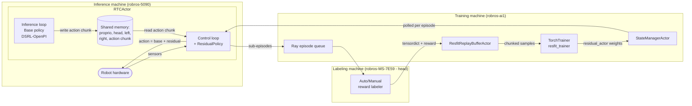

← Back to [docs/residual_rl/README.md](./README.md)

# 00 — Overview of `features/residual_rl`

## Table of contents

- [What this branch is](#what-this-branch-is)
- [Why this branch exists](#why-this-branch-exists)
- [Scope](#scope)
- [System diagram](#system-diagram)
- [How residual RL fits with the existing online_rl docs](#how-residual-rl-fits-with-the-existing-online_rl-docs)
- [Verify with maintainer](#verify-with-maintainer)

---

## What this branch is

`features/residual_rl` wires a learned **residual policy** into the running control loop of the `online_rl` stack and adds the off-policy critic-actor training code needed to optimize that policy from live rollouts. At every control step (40 Hz on igris_b), the existing base policy (DSRL-OpenPI) produces an action chunk; the new residual policy produces a small delta; the *sum* is what reaches the robot. The branch also tightens the human-in-the-loop (HIL) path so an operator can transparently override the policy with teleop.

The branch does **not** change the base policy and does **not** invent a new sensor pipeline. It is additive: it slots a second policy and a second optimizer into the slots that `main` already exposes.

## Why this branch exists

The pre-existing system (see [docs/02_architecture.md](../02_architecture.md), [docs/06_data_flow.md](../06_data_flow.md)) supports **online imitation-learning fine-tuning**: rollouts are recorded into a replay buffer and the same network architecture is trained on the mix of offline + online data. That is fine when behavioral cloning is the goal, but it does not optimize a *return*. The new direction is to **leave the base policy alone** and learn corrections that maximize a learned Q-value.

Concretely, the residual approach trades off two practical concerns:

- The base policy (a VLA, action-chunked diffusion policy) is expensive to fine-tune and easy to break.
- A small MLP-head residual is fast to train and can absorb the long tail of "almost-right but consistently off" behavior that the base policy exhibits in deployment.

## Scope

**In scope on this branch:**

- A new `Policy` implementation, [`ResidualPolicy`](../../env_actor/policy/policies/resfit_policy/resfit_policy.py), with its component YAMLs ([resfit_policy.yaml](../../env_actor/policy/policies/resfit_policy/resfit_policy.yaml), [components/resfit_residual_actor.yaml](../../env_actor/policy/policies/resfit_policy/components/resfit_residual_actor.yaml)).
- A new replay buffer, [`ResfitReplayBufferActor`](../../data_bridge/resfit_replay_buffer.py), that stores both `action` and `base_policy_action` per step and exposes LeRobot-style chunked samples.
- New CLI flags on [`run_online_rl.py`](../../run_online_rl.py): `--use_residual_rl`, `--residual_policy_yaml`, `--use_human_intervention`.
- Wiring inside the RTC inference algorithm so the control loop, not the inference loop, owns the residual policy and applies it at every tick.
- A symmetric HIL package (`env_actor/human_in_the_loop/inference_algorithms/rtc/{rtc_actor,actors/{control,inference}_loop}.py`) that adds teleop intervention on top of the residual loop.
- Smooth POLICY ↔ TELEOP handoff via `ActionMux` and a robot-specific interpolator.
- The trainer-side scaffolding (residual actor module, Q-function module, `resfit_trainer`, `Actor_Trainer`, `Critic_Trainer`) — these live inside the `trainer` submodule at the SHA pinned by this branch.

**Deliberately out of scope on this branch:**

- The base policy weights and the DSRL-OpenPI architecture. The two YAML changes under `env_actor/policy/policies/dsrl_openpi_policy/components/` (`noise_actor.yaml`, `noise_processor.yaml`, `openpi_model.yaml`) just reconcile feature dimensions and the prompt with the checkpoint actually used at training time — they are not part of residual RL itself.
- The reward labeler. Both the manual and the auto labeler are pre-existing components. The branch consumes whatever reward the labeler writes to the replay buffer; it does not change how the reward is produced.
- The Tailscale-based Ray cluster. The cluster is the same as on `main`; the only change in [`start_ray.sh`](../../start_ray.sh) is bumping the symbolic resource counts (`labeling_pc`, `training_pc`, `inference_pc`) from small integers to `100` so resource fragmentation no longer blocks scheduling.
- The data labeler reward signal definition itself — refer to [docs/06_data_flow.md](../06_data_flow.md).

## System diagram

The high-level shape of the system on this branch:

For a clean before/after comparison see [02_architecture_changes.md](./02_architecture_changes.md). For the step-by-step temporal flow see [06_data_flow_and_lifecycle.md](./06_data_flow_and_lifecycle.md).

## How residual RL fits with the existing `online_rl` docs

The pre-existing `docs/` tree already documents:

- The Ray actor topology and the inference-vs-training split — [docs/02_architecture.md](../02_architecture.md).
- The runtime/JSON/YAML config layers — [docs/04_configuration.md](../04_configuration.md).
- The Policy Protocol that any new policy must satisfy — [docs/05_policy_protocol.md](../05_policy_protocol.md).
- The data flow from sensors to weight update — [docs/06_data_flow.md](../06_data_flow.md).

These docs are still correct as background. The `docs/residual_rl/` set explains **what changes** in those flows when you add residual RL, and **why**. Where a topic is unchanged we link out to the pre-existing doc rather than copying it.

## Verify with maintainer

Items the doc author could not fully derive from the code at the time of writing:

- **Reward semantics**: the auto reward labeler is treated as a black box. What scale and sign the residual critic is being trained against is determined by the labeler in [`data_labeler/`](../../data_labeler/), not by anything on this branch. Confirm with the labeler maintainer before reasoning about reward magnitudes.
- **Wandb project naming**: the trainer hard-codes the wandb project to `config.data.datamodule.params["task_name"]`, which for residual RL is `'resfit_online_rl'`. Verify your team writes to that project, not a fork.
- **`run_training` is currently called synchronously** in [`run_online_rl.py:176`](../../run_online_rl.py) rather than via `.options(...).remote(...)`. The commented-out lines just above ([`run_online_rl.py:141`-`146`](../../run_online_rl.py)) preserve the previous Ray-task form; check with maintainer before re-enabling it (see [10_faq_onboarding.md](./10_faq_onboarding.md)).
- **`num_workers=1` on the TorchTrainer** is currently the value in [`run_online_rl.py:42`](../../run_online_rl.py); on `main` it was 4. Whether this is a stable choice or a leftover from a single-GPU debugging session is unclear from the code alone.
