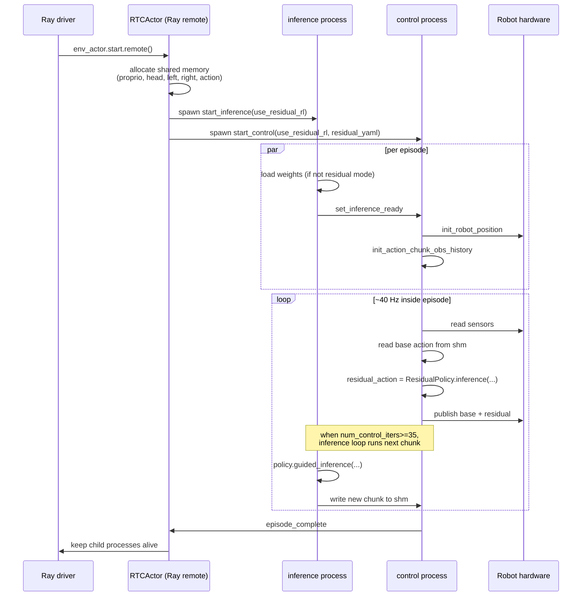

← Back to [docs/residual_rl/README.md](./README.md)

# 02 — Architecture changes vs `main`

## Table of contents

- [Big picture](#big-picture)
- [Before — main](#before--main)
- [After — featuresresidual_rl](#after--featuresresidual_rl)
- [What changed, component by component](#what-changed-component-by-component)
- [Ray resource labels](#ray-resource-labels)
- [Process model inside the RTC actor](#process-model-inside-the-rtc-actor)

---

## Big picture

The cluster shape is the same as on `main`: a Ray head on the labeling PC, the trainer on the AI machine, the inference actor on the 5090 box (see [docs/03_distributed_setup.md](../03_distributed_setup.md) for the network topology). What changes is:

1. **A new policy** runs *inside* the RTC control loop, in addition to the base policy that already ran inside the RTC inference loop.
2. **A new replay-buffer actor** records both the executed action and the base action, and emits LeRobot-style chunked samples instead of single transitions.
3. **A different trainer recipe** (`resfit_trainer`) runs in the `TorchTrainer` slot.
4. **Two policies get weights from different places**: the base policy is loaded from a fixed checkpoint and never updated at runtime, while the residual is loaded from a YAML and refreshed every episode from `StateManagerActor`.
5. **The HIL package gains its own RTC actor** so that teleop intervention works on top of the residual path.

## Before — `main`

```mermaid
flowchart LR
    subgraph inf["inference_pc (robros-5090)"]
      InferenceLoop_M[Inference loop\n DSRL-OpenPI base policy]
      ControlLoop_M[Control loop\n publishes action chunk\n to robot]
      SHM_M[(Shared memory:\nproprio/images/action)]
      InferenceLoop_M -->|write action chunk| SHM_M
      SHM_M -->|read action| ControlLoop_M
      ControlLoop_M -->|sub-episodes| QueueRef_M
    end
    QueueRef_M[Ray episode queue]
    subgraph lab["labeling_pc (head)"]
      Labeler_M[Reward labeler]
    end
    subgraph trn["training_pc"]
      Buffer_M[ReplayBufferActor\n stores per-step rows\n keys: action, reward, proprio, ...]
      Trainer_M[TorchTrainer\n previous trainer recipe]
      StateMgr_M[StateManagerActor]
    end
    QueueRef_M --> Labeler_M
    Labeler_M --> Buffer_M
    Buffer_M --> Trainer_M
    Trainer_M -->|policy weights| StateMgr_M
    StateMgr_M -->|polled at episode boundary| InferenceLoop_M
```

Salient properties:

- The **inference loop** owns weight reloading. Whenever the trainer pushes a new state dict, the inference loop swaps weights at the next episode boundary.
- The **control loop** is "dumb": it reads the next action out of shared memory and forwards it to the robot.
- The replay buffer stores `action` only (not the base action). There is no notion of "policy residual."

## After — `features/residual_rl`

```mermaid
flowchart LR
    subgraph inf2["inference_pc (robros-5090)"]
      InferenceLoop[Inference loop\n DSRL-OpenPI base policy\n weights frozen at runtime when use_residual_rl=True]
      ControlLoop[Control loop\n ResidualPolicy\n action = base + residual]
      SHM[(Shared memory:\nproprio/images/action)]
      InferenceLoop -->|write base action chunk| SHM
      SHM -->|read base action| ControlLoop
      ControlLoop -->|publish combined action| Robot([Robot])
      ControlLoop -->|sub-episodes\nincl. base_policy_action| QueueRef
    end
    QueueRef[Ray episode queue]
    subgraph lab2["labeling_pc (head)"]
      Labeler[Reward labeler\n unchanged]
    end
    subgraph trn2["training_pc"]
      Buffer[ResfitReplayBufferActor\n stores action, base_policy_action,\n reward, proprio, images\n emits chunked windows]
      Trainer[TorchTrainer + resfit_trainer\n Critic_Trainer + Actor_Trainer]
      StateMgr[StateManagerActor]
    end
    QueueRef --> Labeler
    Labeler --> Buffer
    Buffer -->|chunked samples| Trainer
    Trainer -->|resfit_residual_actor weights only| StateMgr
    StateMgr -->|polled at episode boundary| ControlLoop
```

Three diff points to internalize:

1. **The weight-pull arrow now lands on the control loop, not the inference loop.** The base policy's inference loop only pulls weights when `use_residual_rl=False`. Compare:
   - [`control_loop.py:116-127`](../../env_actor/auto/inference_algorithms/rtc/actors/control_loop.py#L116-L127) — control loop polls `policy_state_manager` *iff* `use_residual_rl=True`.
   - [`inference_loop.py:99-109`](../../env_actor/auto/inference_algorithms/rtc/actors/inference_loop.py#L99-L109) — inference loop polls *iff* `use_residual_rl=False`.
2. **The replay buffer emits chunked samples**, not single transitions. The `Critic_Trainer` indexes time slot `0` for the next state and slot `1` for the anchor state ([trainer:critic_trainer.py:32-46](https://github.com/KyunHwan/trainer/blob/3ca051a256c9068f77b556df98f538d9a6185ccf/experiment_training/components/trainer/reinforcement_learning/resfit/utils/critic_trainer.py#L32-L46)). The buffer is described in detail in [03_module_walkthrough.md](./03_module_walkthrough.md#data_bridge).
3. **The episode recorder stores `base_policy_action`** alongside `action`. This is the link between rollout time and training time that lets the actor loss compute `Q(s, a_base + residual(s, a_base))` at train time even though the gradients flow through the residual only.

## What changed, component by component

| Component | On `main` | On `features/residual_rl` | Pointer |
|---|---|---|---|
| Entry point | `run_online_rl.py` instantiates `ReplayBufferActor` and `RTCActor` with no residual flags. | Same script, now takes `--use_residual_rl`, `--residual_policy_yaml`, `--use_human_intervention`. Instantiates `ResfitReplayBufferActor`. `run_training` is invoked **synchronously**, not as a Ray task. | [`run_online_rl.py:79-176`](../../run_online_rl.py#L79-L176) |
| Replay buffer | `ReplayBufferActor` with classic / lerobot_qchunk modes, capacity 10 M. | New `ResfitReplayBufferActor` with three integer knobs (`action_horizon`, `reward_horizon`, `obs_subsample_step`), capacity 100 000, stores `base_policy_action`. | [`resfit_replay_buffer.py:11-198`](../../data_bridge/resfit_replay_buffer.py#L11-L198) |
| Auto RTC actor (top level) | One Ray remote per `(robot, policy, ...)`; no residual flags. | Same Ray remote, now takes `residual_policy_yaml_path` and `use_residual_rl`. | [`auto/.../rtc_actor.py:10-145`](../../env_actor/auto/inference_algorithms/rtc/rtc_actor.py#L10-L145) |
| Auto control loop | Reads action from shm, publishes it as-is. | Builds a residual policy when `use_residual_rl=True`, polls `policy_state_manager`, applies the residual at every tick. | [`auto/.../control_loop.py:90-225`](../../env_actor/auto/inference_algorithms/rtc/actors/control_loop.py#L90-L225) |
| Auto inference loop | Polls `policy_state_manager` unconditionally. | Polls only when `use_residual_rl=False`. | [`auto/.../inference_loop.py:95-109`](../../env_actor/auto/inference_algorithms/rtc/actors/inference_loop.py#L95-L109) |
| Auto shm bridge | `bootstrap_obs_history` + `init_action_chunk` called separately on episode boundary. | New combined method `init_action_chunk_obs_history` that also seeds the action chunk with the robot's home pose (igris_b: `INIT_JOINT_LIST` + scaled `INIT_HAND_LIST`). | [`auto/.../shm_manager_bridge.py:367-394`](../../env_actor/auto/inference_algorithms/rtc/data_manager/robots/igris_b/shm_manager_bridge.py#L367-L394) |
| Episode recorder (igris_b) | `add_action(action, control_mode)`. | `add_action(action, base_policy_action=None, control_mode=0)`. Writes `base_policy_action` only when given. Also adds a `task` (`NonTensorData`) and currently hard-codes a `"pick and place"` fallback. | [`episode_recorder_bridge.py:84-145`](../../env_actor/episode_recorder/robots/igris_b/episode_recorder_bridge.py#L84-L145) |
| HIL RTC actor | **Did not exist** as `rtc_actor.py`. The HIL RTC tree had two top-level Ray actors `InferenceActor` and `ControllerActor`. | Single `RTCActor` Ray actor that spawns inference + control as `multiprocessing` children, mirroring the auto path. | [`hil/.../rtc_actor.py:11-188`](../../env_actor/human_in_the_loop/inference_algorithms/rtc/rtc_actor.py#L11-L188) |
| HIL control loop | Did not exist as a single function — logic was in `control_actor.py` (deleted). | New `start_control` that includes `ActionMux` + teleop + residual. | [`hil/.../actors/control_loop.py:1-258`](../../env_actor/human_in_the_loop/inference_algorithms/rtc/actors/control_loop.py#L1-L258) |
| HIL inference loop | Did not exist as a single function. | New `start_inference` symmetric with the auto path. | [`hil/.../actors/inference_loop.py`](../../env_actor/human_in_the_loop/inference_algorithms/rtc/actors/inference_loop.py) |
| HIL sequential actor | Owned `ControllerInterface` + `DataManagerInterface` from `env_actor/human_in_the_loop/io_interface/...` + the action mux teleop wiring. | Now imports from `env_actor.robot_io_interface.*` and `env_actor.auto.inference_algorithms.sequential.data_manager.*`. Action mux wiring was moved into the RTC control loop. | [`hil/.../sequential_actor.py`](../../env_actor/human_in_the_loop/inference_algorithms/sequential/sequential_actor.py) |
| HIL `ActionMux` | Picked policy vs teleop with no blending. | Same role, but holds a robot-specific `ActionInterpolator` and emits a smooth POLICY→TELEOP trajectory of length 20. | [`action_mux.py:23-110`](../../env_actor/human_in_the_loop/action_mux/action_mux.py#L23-L110), [`interp_interface.py`](../../env_actor/human_in_the_loop/action_mux/interp_utils/interp_interface.py), [`igris_b_interpolator.py`](../../env_actor/human_in_the_loop/action_mux/interp_utils/robots/igris_b/igris_b_interpolator.py) |
| HIL pedal switch | `$` toggled mode; `^` was an explicit POLICY signal. | `$` always goes to TELEOP; `#` always goes to POLICY. Stateless edges, easier to reason about. | [`intervention_switch.py:53-62`](../../env_actor/human_in_the_loop/action_mux/intervention_switch.py#L53-L62) |
| HIL teleop provider | Required a `SingleThreadedExecutor` from the caller; both nodes shared one spin loop. | Owns *two* `SingleThreadedExecutor`s + two daemon threads, one per node. | [`teleop_provider.py:46-83`](../../env_actor/human_in_the_loop/action_mux/teleop_provider.py#L46-L83) |
| Dynamixel arm reader | A single failed sync-read raised. | Tolerates up to 10 consecutive sync-read failures, pings each ID at startup, and degrades gracefully. | [`arms_dynamixel.py:104-189`](../../env_actor/human_in_the_loop/teleoperation/robots/igris_b/arms_dynamixel.py#L104-L189) |
| `human_in_the_loop/io_interface/` | Held duplicates of `controller_interface.py`, `controller_bridge.py`, `camera_utils.py`, `data_dict.py`, plus stubs for igris_c. | **Deleted in its entirety.** The HIL path now imports from `env_actor/robot_io_interface/` directly. | parent diff `D env_actor/human_in_the_loop/io_interface/**` |
| `robot_io_interface` | No `ros_node` accessor on `ControllerInterface` / `ControllerBridge`. Bridge called `rclpy.shutdown()` in `shutdown()`. | Adds a `ros_node` property on both; bridge no longer calls `rclpy.shutdown()` itself (the control loop does it after teleop is torn down). | [`controller_interface.py`](../../env_actor/robot_io_interface/controller_interface.py), [`controller_bridge.py`](../../env_actor/robot_io_interface/robots/igris_b/controller_bridge.py) |
| `inference_engine_utils` in HIL RTC | Lived under `human_in_the_loop/inference_algorithms/rtc/inference_engine_utils/` (with `action_inpainting.py` and `max_deque.py`). | Deleted; `max_deque.py` moved to `env_actor/auto/.../data_manager/utils/`, and `utils.py` was renamed to `shared_memory_utils.py` (the canonical copy is the auto one). | parent diff `R100 .../inference_engine_utils/max_deque.py .../data_manager/utils/max_deque.py`, `D .../inference_engine_utils/action_inpainting.py` |
| `start_ray.sh` | Symbolic capacities of `4 / 3 / 1` per machine. | All raised to `100` so scheduling does not block on quotas. The commented older config in the lower half is left for reference. | [`start_ray.sh:18-39`](../../start_ray.sh#L18-L39) |
| `data_labeler/auto/inference_algorithms/rtc/**` | (unchanged) | (unchanged) | n/a |

For the full file-by-file diff with line citations, see [03_module_walkthrough.md](./03_module_walkthrough.md).

## Ray resource labels

The resource labels did not change semantically. They are the same three keys (`labeling_pc`, `training_pc`, `inference_pc`) used to bind specific actors to specific physical machines.

| Actor | Resource label | Where it is set |
|---|---|---|
| `RTCActor` (auto or HIL) | `inference_pc: 1` | [`run_online_rl.py:111-112`](../../run_online_rl.py#L111-L112) |
| `ResfitReplayBufferActor` | `training_pc: 1` | [`run_online_rl.py:88-89`](../../run_online_rl.py#L88-L89) |
| `StateManagerActor` | `training_pc: 1` | [`run_online_rl.py:84-85`](../../run_online_rl.py#L84-L85) |
| `TorchTrainer` workers | `training_pc: 1` per worker, `use_gpu=True`, `num_workers=1` | [`run_online_rl.py:40-44`](../../run_online_rl.py#L40-L44) |
| Reward labelers | `labeling_pc: 1`, `num_gpus=1` for auto | [`run_online_rl.py:153-173`](../../run_online_rl.py#L153-L173) |

The `start_ray.sh` capacities were raised from small integers (`{labeling_pc:4, training_pc:3, inference_pc:1}`) to `100` each so multi-actor placement does not block on resource accounting.

## Process model inside the RTC actor

`RTCActor` is a single Ray remote that, when started, **spawns two OS processes** via `multiprocessing.get_context("spawn")` and shares state through `multiprocessing.shared_memory`. The processes synchronize using `Condition`, `Event`, and `Value`. This was also the design on `main`; the only thing this branch changes is that the control-loop process now constructs and runs an additional `ResidualPolicy` on its own GPU.

See [06_data_flow_and_lifecycle.md](./06_data_flow_and_lifecycle.md) for the full lifecycle including the queue → buffer → trainer arrows.
