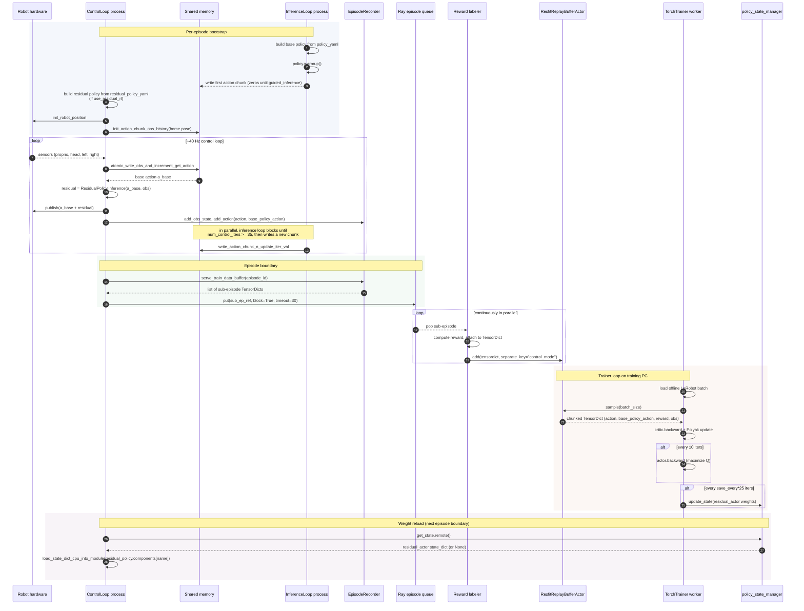

← Back to [docs/residual_rl/README.md](./README.md)

# 06 — Data flow and lifecycle

This chapter follows a single piece of data from "robot reads a sensor" to "trainer applies a gradient that affects future actions." Read it after [02_architecture_changes.md](./02_architecture_changes.md).

## Table of contents

- [Lifecycle of one episode](#lifecycle-of-one-episode)
- [End-to-end sequence diagram](#end-to-end-sequence-diagram)
- [Where data is shaped and where it is named](#where-data-is-shaped-and-where-it-is-named)
- [Base policy weights](#base-policy-weights)
- [Residual policy weights](#residual-policy-weights)
- [Back-pressure and queue mechanics](#back-pressure-and-queue-mechanics)

---

## Lifecycle of one episode

1. **Reset.** The control loop calls `shm_manager.reset()`, sleeps 1.5 s, then `init_action_chunk_obs_history(obs_history=controller_interface.read_state())`. This seeds the shared-memory action buffer with the home pose (see [`shm_manager_bridge.py:367-394`](../../env_actor/auto/inference_algorithms/rtc/data_manager/robots/igris_b/shm_manager_bridge.py#L367-L394)).
2. **Inference ready handshake.** The inference loop signals ready once its policy is loaded; the control loop unblocks ([`control_loop.py:138-144`](../../env_actor/auto/inference_algorithms/rtc/actors/control_loop.py#L138-L144), [`inference_loop.py:111-113`](../../env_actor/auto/inference_algorithms/rtc/actors/inference_loop.py#L111-L113)).
3. **Per-step loop** (≈ 40 Hz, up to 1 000 steps):
   1. `controller_interface.read_state()` — pulls latest proprio + RGB into a dict.
   2. `episode_recorder.add_obs_state(obs_data)` — appends to the in-memory episode buffer.
   3. `shm_manager.atomic_write_obs_and_increment_get_action(...)` — writes observation into shared memory and reads back the **next base action** from the chunk the inference loop wrote earlier.
   4. *If residual mode*: `residual_policy.inference(base_policy_action, obs_data)` returns a 24-D delta; `action = base + residual`. Before the first weight push, the delta is uniform random in `[-0.08, 0.08]`.
   5. `controller_interface.publish_action(action, prev_joint)` sends the action to the robot (slew-rate limiting inside the bridge).
   6. `episode_recorder.add_action(action=action, base_policy_action=base_policy_action)` — store both for later.
   7. Sleep to maintain target HZ.
4. **Chunk regeneration.** Concurrently, when `num_control_iters >= 35` ([`inference_loop.py:18`](../../env_actor/auto/inference_algorithms/rtc/actors/inference_loop.py#L18)), the inference loop runs `policy.guided_inference(...)` and writes a fresh chunk into shared memory.
5. **Episode end** (either step 1 000 or stop event):
   - `episode_recorder.serve_train_data_buffer(episode)` returns a list of sub-episodes (each a `TensorDict`).
   - Each sub-episode is pushed onto the Ray `episode_queue` via `ray.put` ([`control_loop.py:147-155`](../../env_actor/auto/inference_algorithms/rtc/actors/control_loop.py#L147-L155)).
   - The control loop loops back to step 1.
6. **Labeling.** A reward labeler actor pops sub-episodes from the queue, attaches a per-step reward, then calls `replay_buffer.add(tensordict, separate_key='control_mode')`.
7. **Training.** The trainer process is already running. It keeps calling `replay_buffer.sample(batch_size)` and stepping the critic / actor optimizers. Every `save_every × 25` iterations it pushes the residual-actor weights to `policy_state_manager` ([`online_trainer.py:526-542`](https://github.com/KyunHwan/trainer/blob/3ca051a256c9068f77b556df98f538d9a6185ccf/trainer/online_trainer.py#L526-L542)).
8. **Weight reload.** At the next episode boundary in step 1, the control loop polls `policy_state_manager.get_state.remote()`. If a new state dict is present, the residual actor's weights are swapped in-place via `load_state_dict_cpu_into_module` ([`control_loop.py:117-127`](../../env_actor/auto/inference_algorithms/rtc/actors/control_loop.py#L117-L127)).

The loop continues until the user sends a stop event (currently: `kill -9` of the driver process or `Ctrl-C`).

## End-to-end sequence diagram

## Where data is shaped and where it is named

A single per-step row goes through three renamings before the trainer sees it:

1. **Raw sensor read** at [`controller_interface.read_state()`](../../env_actor/robot_io_interface/controller_interface.py) produces a dict like `{proprio, head, left, right}`. Image dtype is `uint8`, shape `(C, H, W)` (mono cam) or `(num_img_obs, C, H, W)` (chunked image history).
2. **Per-step TensorDict** at `EpisodeRecorderBridge.add_action` ([`episode_recorder_bridge.py:130-145`](../../env_actor/episode_recorder/robots/igris_b/episode_recorder_bridge.py#L130-L145)) wraps `{action, base_policy_action, control_mode}` as `torch` tensors. Combined with `add_obs_state(obs_data)` rows, the final per-episode TensorDict has keys `{episode, reward, task_index, task, ("next","done"), proprio, head, left, right, action, base_policy_action, control_mode}`.
3. **Replay-buffer LeRobot output** at `_pack_lerobot_like` ([`resfit_replay_buffer.py:136-180`](../../data_bridge/resfit_replay_buffer.py#L136-L180)) renames into:
   - `action`, `base_policy_action`, `labels.reward`, `labels.done` — kept as-is.
   - `observation.current`, `observation.state` — both get the same proprio chunk.
   - `observation.images.cam_head/left/right` — uint8 image chunks.

That third schema is what the trainer reads. Anything you store in the recorder that does not survive the rename is invisible to the loss. The matching `delta_timestamps` in the offline dataloader ([resfit_lerobot_data.py:52-60](https://github.com/KyunHwan/trainer/blob/3ca051a256c9068f77b556df98f538d9a6185ccf/experiment_training/components/dataloader/resfit_lerobot_data.py#L52-L60)) uses the same key names so the two sources can be concatenated on `dim=0`.

## Base policy weights

- **Loaded once** at process start in [`inference_loop.py:67-72`](../../env_actor/auto/inference_algorithms/rtc/actors/inference_loop.py#L67-L72) by `build_policy(policy_yaml_path=...)`. The checkpoint path lives inside the policy YAML (for DSRL-OpenPI, it is `params.ckpt_dir` in [`openpi_model.yaml`](../../env_actor/policy/policies/dsrl_openpi_policy/components/openpi_model.yaml)).
- **Never reloaded** when `use_residual_rl=True` ([`inference_loop.py:98-99`](../../env_actor/auto/inference_algorithms/rtc/actors/inference_loop.py#L98-L99)). The base is *frozen for the run*.
- **Re-built per process** because each Ray child process is spawned with `spawn`, not `fork`. The inference loop's GPU memory holds a fresh instance.

## Residual policy weights

- **Loaded once** at process start in [`control_loop.py:101-105`](../../env_actor/auto/inference_algorithms/rtc/actors/control_loop.py#L101-L105) by `build_policy(policy_yaml_path=residual_policy_yaml_path)`. If you put a checkpoint path in `resfit_policy.yaml: policy.params.checkpoint_path`, the constructor will load `<dir>/resfit_residual_actor.pt` at construction time ([`resfit_policy.py:52-56`](../../env_actor/policy/policies/resfit_policy/resfit_policy.py#L52-L56)). Otherwise the weights are random (Xavier init).
- **Polled per episode** at [`control_loop.py:116-127`](../../env_actor/auto/inference_algorithms/rtc/actors/control_loop.py#L116-L127). If `policy_state_manager.get_state.remote()` returns non-`None`, the new weights overwrite the in-process module. A persistent `residual_policy_updated = True` flag flips from random-noise exploration to learned residual.
- **Pushed by the trainer** every `save_every × 25` iterations from the worker with rank 0 only ([`online_trainer.py:522-543`](https://github.com/KyunHwan/trainer/blob/3ca051a256c9068f77b556df98f538d9a6185ccf/trainer/online_trainer.py#L522-L543)). The trainer moves weights to CPU first, uses `ray.put` to share via plasma, and sends the object ref through `policy_state_manager.update_state.remote(weights_ref)`. Only the residual actor is pushed; the Q-function is `online_update=false`.

## Back-pressure and queue mechanics

| Element | Capacity | Behavior when full |
|---|---|---|
| Shared-memory action chunk | `runtime_params.action_chunk_size` × `action_dim` | Overwritten in place every chunk regeneration — no concept of "full." |
| Shared-memory proprio history | `runtime_params.proprio_history_size` × `proprio_state_dim` | Ring buffer; oldest sample is dropped. |
| Ray episode queue (`RayQueue`) | `RAYQUEUE_MAXSIZE = 5` ([`run_online_rl.py:33`](../../run_online_rl.py#L33)) | The control loop calls `put(..., block=True, timeout=30)`. On timeout the sub-episode is **dropped** with a warning ([`control_loop.py:151-155`](../../env_actor/auto/inference_algorithms/rtc/actors/control_loop.py#L151-L155)). |
| Replay buffer (LazyMemmapStorage) | `100_000` rows | Oldest rows are overwritten when capacity is exceeded. |
| `policy_state_manager` | 1 slot | Each new push overwrites the previous; old refs are GC'd. |

The 30-second timeout is the system's only deadlock guard for "labeler is stuck." If you start seeing "Episode queue full, dropping sub-episode from episode X" in the control-loop logs, look at the labeler logs *first*, not the buffer.
